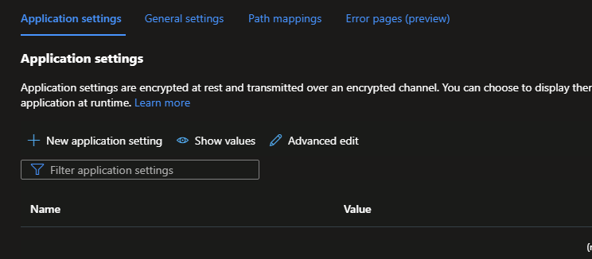

# Configurations for App Service
### General description
App Service has different configurations available and are grouped by categories on different tabs in Azure portal
1. Application settings
2. General setting
3. Default documents: $\color{red}{Windows}$ $\color{red}{OLNY!!!}$.
4. Path mapping
5. Error pages ($\color{orange}{in}$ $\color{orange}{Preview}$). 

### LAB 1 - OS dependencies
Objective: Configuration options differ based on OS

1. Create App service resouce for Windows
2. After resource is created go to resource and open Configuration
	> - all 5 options mentioned in general description should be available 


3. Create App service resouce for Linux
4. After resource is created go to resource and open Configuration
	> - only 4 options mentioned in general description should be available 
	
	$\color{red}{!!!Default}$  $\color{red}{documents}$ is only for Windows



### Default routing vs Custom routing
By default, App Service starts your app from the root directory of your app code. But certain web frameworks don't start in the root directory.
> For more details see official documentation [Map URL Path to directory](https://learn.microsoft.com/en-us/azure/app-service/configure-common?tabs=portal)

### LAB 2 - Path mappings
Objective: We will create a simple Web app to explain configurations options for deployment 
By default the web server hads a defult folder for deployment (site\wwwroot). SOme applications does have a different folder where app starts.
This lab will explain how App Service should be configured in this case.

#### We will create a simple webapp and default App Service on windows
1. Create in Visusl Studio a simple ASP.NET Core Web App (Model-View-Controller)
2. Run local the app to see the result. The application is lunched on localhost
3. Create in Azure a App Service for Windows
4. Verify the app url in a new tab - default page of the webserver should be available


#### Change your app for run on different folder
1. Right click on your web app -> Properties
2. Expand Build section 
3. Select Output and add $\color{red}{bin\test}$ as a Base output path
4. Go to Debug Section and click on Open Debug lunch UI 
5. On the IIS Experess fo to the App URL and add test to the url like in immage below:


#### Deploy your app
**Deployment Profile**
1. From Visual Studion - Create a new deployment profile with "test" added on Site name and Destination URL:


In order to deploy the app in test folder the Path mapping must be added to the App Service configuration.
To check this step try to publish your app from Visual Studion and web depolyment error will be shown.


**Path mapping Configuration**
1. Go to portal and open your App Service
2. Open tthe app URL in a new tab - default page will be available
3. Add **/test** to the URL and run - the response should be HTTP ERROR 500 
4. Goo back in portal on your App Service resource
5. Go to the configutation feature then choose Path mappting
6. Add a new Virtual application and directory 

7. Save the configuration
8. Go to overview and restart the Web app
9. Check the web again in a new tab. Yut URL should be **azure-web-app-URL/test**
	-> application was not deployed yet but the urs should respond with the message: 
	```diff
	+ The resource you are looking for has been removed, had its name changed, or is temporarily unavailable.
	```

**Deploy your app**

11. Deploy your app again from VS - now the deployment and app should work

