Search for 'Azure Active directory' service:

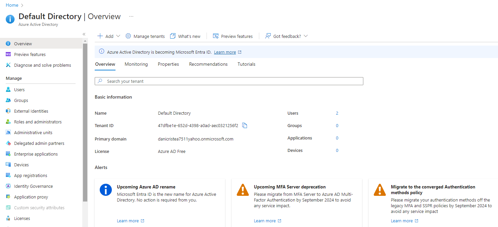

By Default, the license is 'Azure AD Free'

Go to the Users section, you will be redirceted to AllUsers

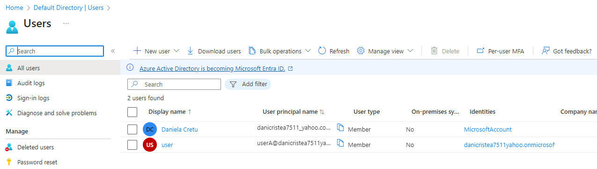

1. Create a new User, click on 'Create user', theer are 2 options:
- Create new user - Create a new intrenal user in your organization
- Invte external user - Invite an external  user to collaborate with your organization

Chose the first option:
Required fieds:
user principal name
Display name
Password (it will be change first time when the user lg in)

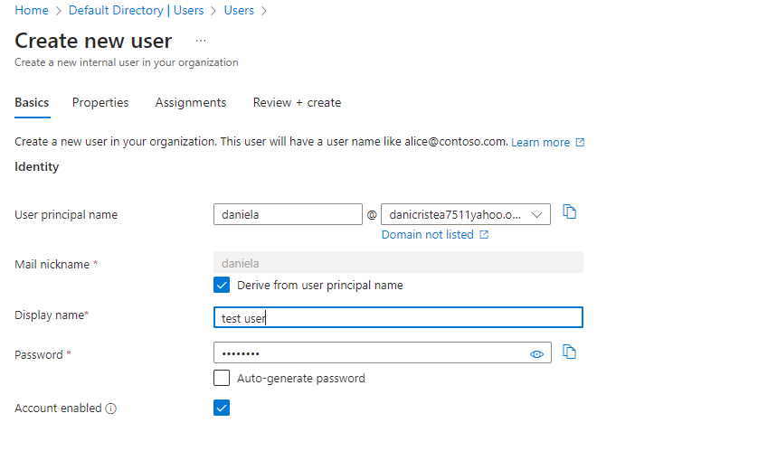

Click on Create.
The user will have to access by default. You have to give him access = permission

2. Role-based access Control:
Provids authorization for the Resources that are part to your Azure subscription

There are 
- build-in roles: Contributor, Owner, Reader, User Access Administrator 
- Custom roles
- 
There are roles based on various services.

The user created before has no access.
Create a storage account, open it.
Give access on this storage account to the user created before, by going into the section 'Access Control (IAM)'

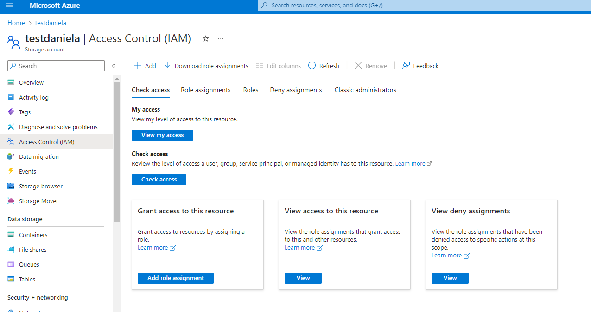

Click on Add => Add role assignment

Choose the Reader role => Next
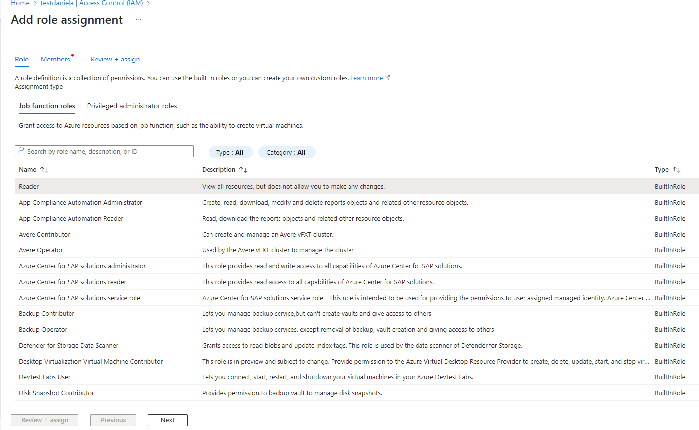

Click on Select members ? select the user created before 'test user' => click on next
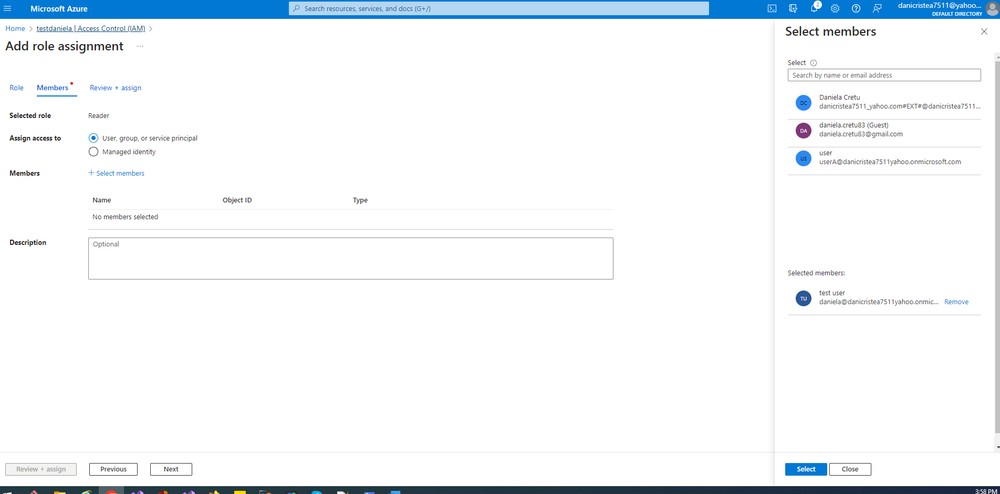

Review+assign

You can apply a role on a resource group or on a Subscription

3. Application Objects
It is something that you will define in Azure Active directory.
E.g.Having an app and a Storage Account. One way to give access to a storage acoutn for that app is by setting the Authorization on the Storage Account.
The best approach is by defining an Application Object that can give access via role-bas access control onto the Azure storage account.

Advantages:
- An Application Object can be used to give access on different resources as part of your resource account
- An Applictaion Object can also assume the permissions of an user that log into the new app created.
- The Applictaion object implementation is part of the Microsft Identity platform.
- It helps to build applications that users and csutomers can sign in using their Microsift accounts or social accounts.
- 
3.1 Application Object - Blob Objects

Define an Application Objects in Azure Active Directory that will behaves like an identity, we will give permissions to this application object on an storage account via teh use of role-based access control.

Having an Storage Account with a Container 'test'
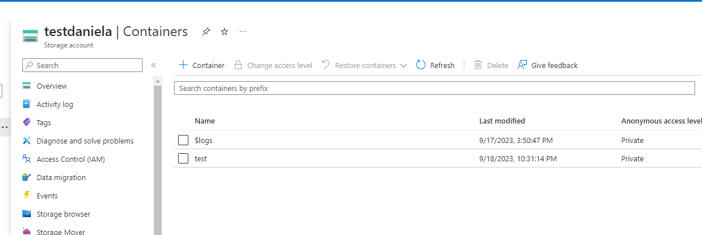

and upload a file into it:
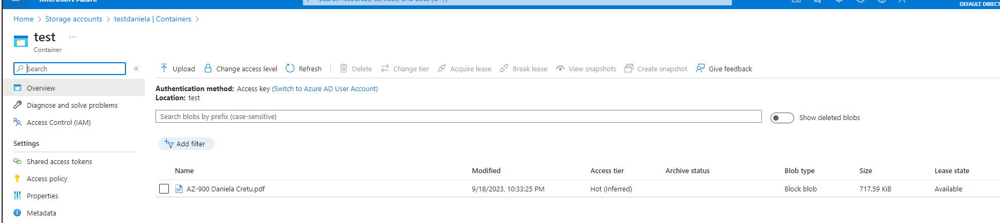

and Register an Application Object in Azure Active Directory (register a new identity in Azure Active Directory) => App registration:
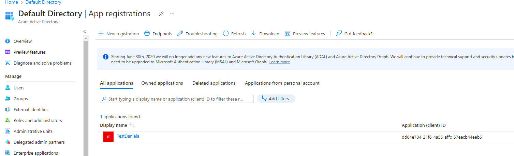

Associate the Application Object with your .NET based application.

Go to the storage account and assign permission onto the Application Object 'TestDaniela'
Go onto the storage account => Acces Control => Add Role assignment:

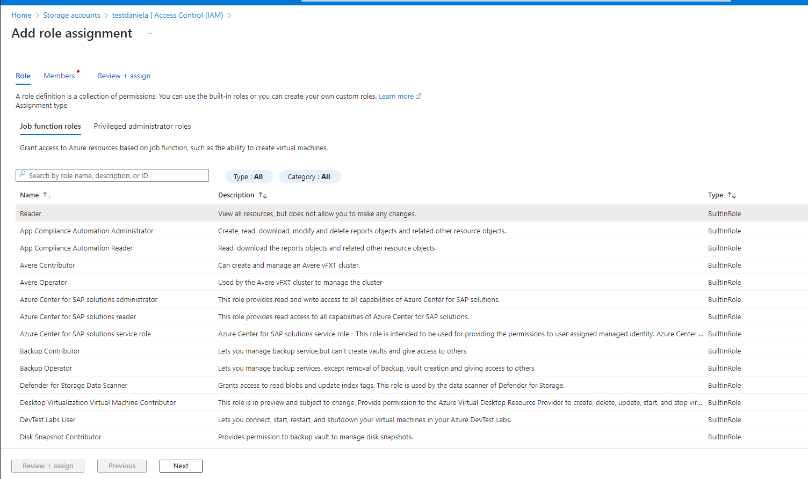

Next => Select members => search for the Application object 'TestDaniela'
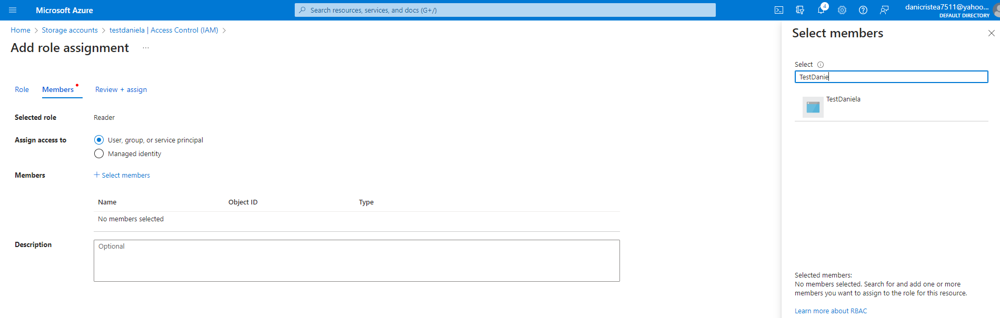

Select it and Create and Review.
Add another role Assigment:
Search for the permission 'Storage Blob Data Contributor' and assign it to the Application object 'TestDaniela' following teh before steps.

Create a Console project 'ApplicationObject.csproj'
Install the nuget packages 'Azure.Storage.Blobs', Azure identity

In the Program.cs write the following code to download a blog file uploaded in the Storage Account Conrtainer 'Test'
See the code from ..\AZ900Prep\Daniela\Security\Applictaion Object\ApplicationObject\Program.cs

Extract the Application Object information:
Cleint id, Tenant id md Client secret:

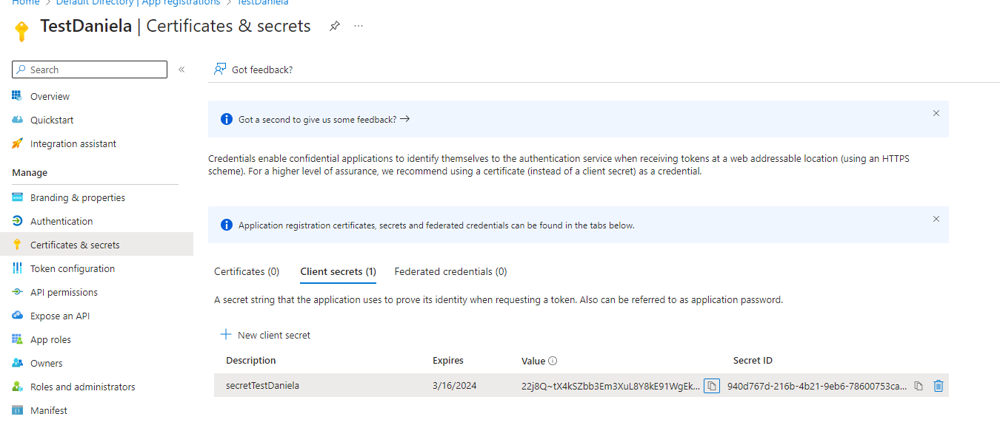
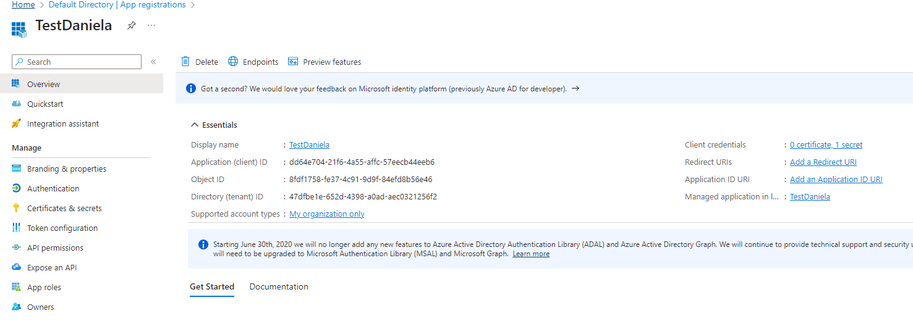

