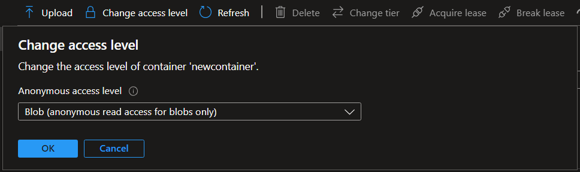

# Storage Account
### General description

Description of labs:
1. Lab 1: We will crate a simple console application see how the configuration files can be implemented from scratch. 

	This lab will help us to keep application setting safe for sensitive data like connection strings

2. Lab 2: Manage blobs in Storage account from .Net Core application

	For this we will use this application created in the Lab 1. 
	To manage blobs from applications the connection string to the Storage account is needed. 
	Connection string will be readed from a config file.

### LAB 1 - Secure application settings in .Net using User Secrets - Hosting approach
$\color{green}{Objective:}$ Understand basic implementation for secure app settings in .Net core apps
, importand packages for configuration (**Microsoft.Extensions.Configuration, Microsoft.Extensions.Hosting**)
For more details follow [Configuration in .Net](https://learn.microsoft.com/en-us/dotnet/core/extensions/configuration) documentation

1. Create basic Console app
2. Add appsettings.json configuration file
3. Secure configurations by using user secrets on local development:
	- In order to secure the configuration for an app, local user secrets can be used.
	- How to use user secrets from Visual Studio
	
		-> Right click on project -> Manage User Secrets

		**Investigate the changes:**
		
		By enabling Manage user secrets, it will do next changes

			- generate a secrets.json file under current user ~/AppData/Roaming/Microsoft/UserSecrets/<local_generated_id>
			- package Microsoft.Extensions.Configuration.UserSecrets will be added to the project Dependencies/Packages
			- <UserSecretsId>local_generated_id</UserSecretsId> is added to csproj file

4. Add sensitive configuration to secrets.json on your local
			
	Add the next config to your secret.json file
		
		{
			"MySecretConfiguration":  "this configuration is local on my secret and is not avalable under source control"
		}
-------------------------------------------------------------------
** $\color{green}{Remark:}$ **

-> Options to add configuration to console app are

a. Using configuration builder Microsoft.Extensions.Configuration
b. Hosting approach 

-> Console app can be changed to a host app by using Package: Microsoft.Extensions.Hosting

We will use hosting approach. Hosting package already contains Microsoft.Extensions.Configuration.UserSecrets so we will remove installed package firs and install the Hosting package.

--------------------------------------------------------------------

5. Console app as a host

	a. right ckick on dependecies
	b. uninstall Microsoft.Extensions.Configuration.UserSecrets
	b. add Microsoft.Extensions.Hosting package 
6. Create the host

		Build the host:
		var builder = Host.CreateApplicationBuilder(args);

7. Add User secret to the configuration
	a. Go to Program.cs
	b. Add the secret config to the builder
		
			builder.Configuration.AddUserSecrets(Assembly.GetExecutingAssembly(), true);
			var host = builder.Build();
8. Get configuration from configuration file and print to the console

		var storageConnectionString = builder.Configuration.GetConnectionString("MySecretConfiguration");
		Console.WriteLine(storageConnectionString);

9. Run the host

		await host.RunAsync();

After step 9 the code frome Program.cs should look like this:
		
	using Microsoft.Extensions.Configuration;
	using Microsoft.Extensions.Hosting;
	using System.Reflection;
	
	var builder = Host.CreateApplicationBuilder(args);
	
	builder.Configuration.AddUserSecrets(Assembly.GetExecutingAssembly(), true);

	var host = builder.Build();

	var storageConnectionString = builder.Configuration.GetConnectionString("MySecretConfiguration");

	Console.WriteLine(storageConnectionString);

	await host.RunAsync();
**10. Observe the result**

Result: The text "this configuration is local on my secret and is not avalable under source control" is printed.

### LAB 2 - Manage blobs in Storage account from .Net Core application	
$\color{green}{Objective:}$ Implementation in .Net Core for managing blobs in Azure

----------------------------------------------------------------------------------
** $\color{green}{Remark:}$ **
Microsoft provides different packages to manage resources in Azure. For working with features from Storage account 
the namespace Azure.Storage contains the next important packages (not all packages are listed):
- Azure.Storage.Blob - used for manage blobs
- Azure.Storage.File.Share - used for manage shared files
- Azure.Storage.Queue - used for manage queues

----------------------------------------------------------------------------------

1. Go to portal and a Storage Account - General Propose V2 
2. Add Azure.Storage.Blob package to the project created at Lab 1
3. Add configuration string to the Storage account to the secret.json (replace the initial config with the next configuration)

		"ConnectionStrings": {
			"StorageAccountConnectionString": "replace the connection string with your account connection string"
		}
4. Replace "MySecretConfiguration" with "StorageAccountConnectionString" in the preview writed code 
5. Go to portal -> Access keys -> copy connection key of key1
6. Replace value set for  "StorageAccountConnectionString" with your Storage account connection string 
7. Create a container for store blobs
	Obs. Blob package provide BlobServiceClient class that is used for manage blobs.  

		string containerName = "newcontainer";
		BlobServiceClient blobServiceCLient = new BlobServiceClient(storageConnectionString);

		var containers = blobServiceCLient.GetBlobContainers();
		Console.WriteLine(containers.Count());
		var container = containers.FirstOrDefault(c => c.Name == containerName);
		if (container == null)
			blobServiceCLient.CreateBlobContainer(containerName, PublicAccessType.Blob);
8. Run the app
9. Observe the result:
- Go to portal and verify in Storage account that the **newcontainer** was created
- Click on Change access level and verify that accesibility is anonymous read access for blobs only

		